**Nombre:**Nicolas Andres Pasaje Gonzalez - 20261244286

**Programa Academico:** Tecnologia de Desarrollo de Software

**Fecha de Entrega:** 17/09/2026

*Ejercicios Realizados*

**Arreglos/Arrays:**
4.b.1. Escribe un programa que lea 5 números por teclado y que los almacene en un array. Rota los elementos de ese array, es decir, el elemento de la posición 0 debe pasar a la posición 1, el de la 1 a la 2, etc. El número que se encuentra en la última posición debe pasar a la posición 0. Finalmente, muestra el contenido del array.
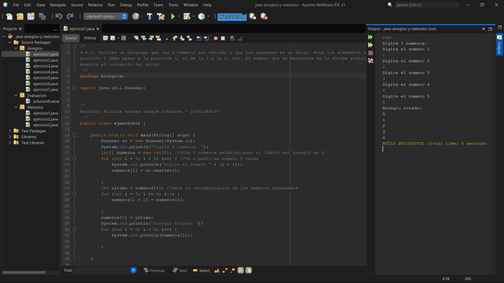

4.b.4. Realiza un programa que termine cuando el usuario haya metido todos los números comprendidos entre el 1 y el 10. 
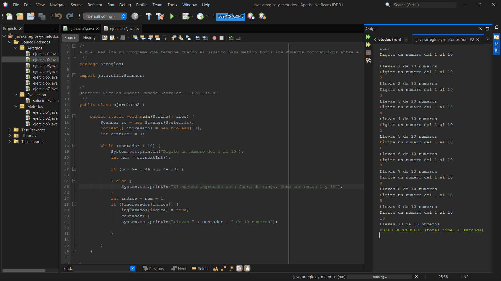

4.a.5. Dados estos arrays

String [] nombreDeCadaAlumno = {"Eva","Jose","Pepa","Ana","Juanjo"}
int[] notasDeCadaAlumno = {8,2,5,4,9};

donde cada posición de un alumno corresponde con la posición de su nota, hacer un bucle que nos diga los nombres de los alumnos que han aprobado y su nota, esto es, debe escribir en la consola:

Eva ha aprobado con un 8
Pepa ha aprobado con un 5
Juanjo ha aprobado con un 9

MEJORA 1: Crear los arrays sin contenido y pedir los datos al usuario por teclado. Las notas pueden tener decimales.

MEJORA 2: Además de lo anterior, al final se muestran los nombres de los alumnos suspendidos, separados por comas. La salida entonces puede ser algo así:

Luis ha aprobado con un 8
Carlos ha aprobado con un 5
Juanjo ha aprobado con un 9
Han suspendido: Jose, Pedro

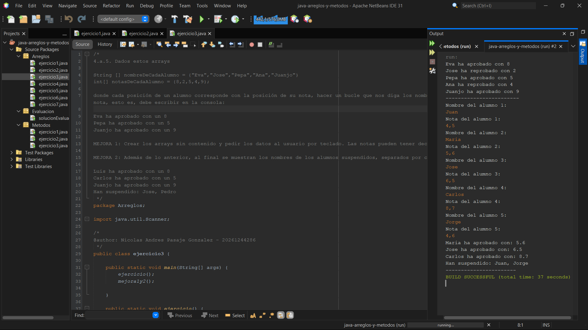

4.a.2. Hacer un bucle que pida por teclado 10 números enteros y los almacene en un array, y que se calcule posteriormente la suma de los números que sean pares y la suma de los números que sean impares, y que nos diga por pantalla cual de las dos sumas es mayor
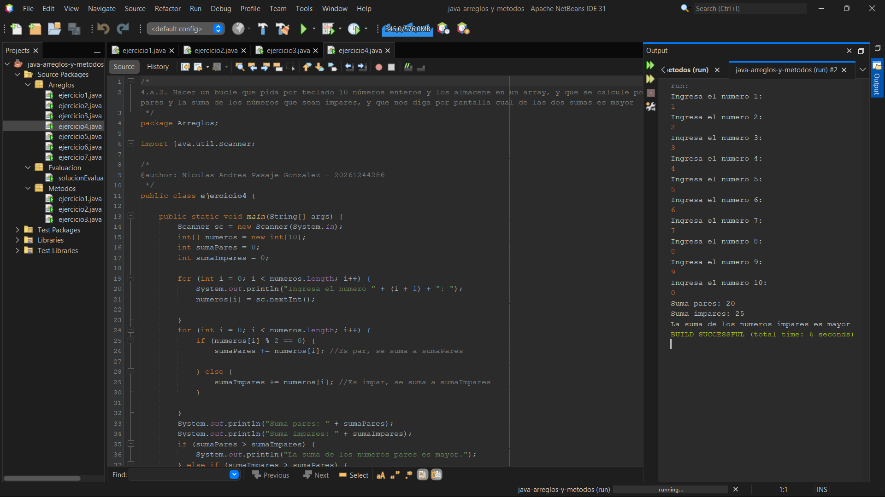

4.a.3. Temperaturas. Se piden por teclado la temperatura de cada uno de los 7 días de una semana y se almacenan en un array de 7 elementos. Posteriormente, se pide por teclado una nueva temperatura, y se compara con las leídas anteriormente para decir si tal nueva temperatura se dio en algún día de la semana (si tal nueva temperatura existe en el array de temperaturas de la semana).
MEJORA 1: Decir en que día o días se dio dicha temperatura 

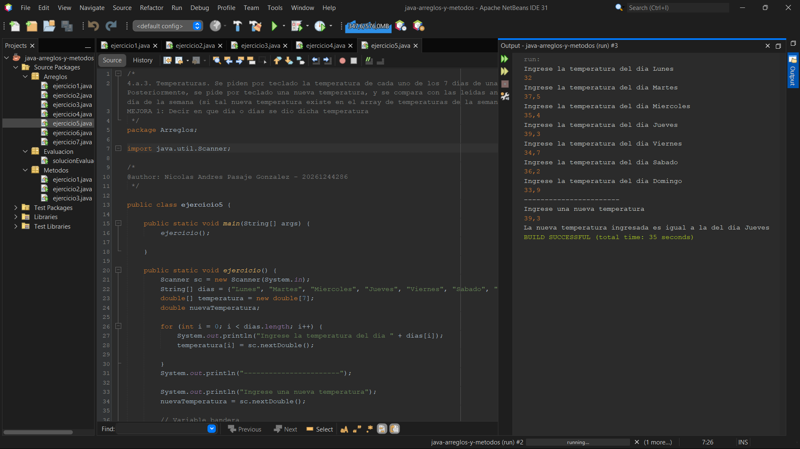

4.c.3. Hacer un programa que muestre un menú de este tipo:
"1.- Introducir nota"
"2.- Mostrar nota media"
"3.- Mostrar notas extremas"
"4.- Mostrar notas"
"0.- Salir"
De modo que si se opta por:
✤ la opción 1 pide por teclado una nueva nota, y se guarda en un array
✤ la opción 2 muestra la nota media de todas las introducidas hasta ese momento
✤ la opción 3 muestra la menor y la mayor de todas las notas introducidas hasta ese momento
✤ la opción 4 muestra todas las notas introducidas hasta ese momento
✤ la opción 0 acaba el programa
MEJORA 1: Al ejercicio anterior, añadirle una opción "5.- Eliminar nota” que nos pedirá un número, y eliminara la nota que tenga en el array ese número como índice

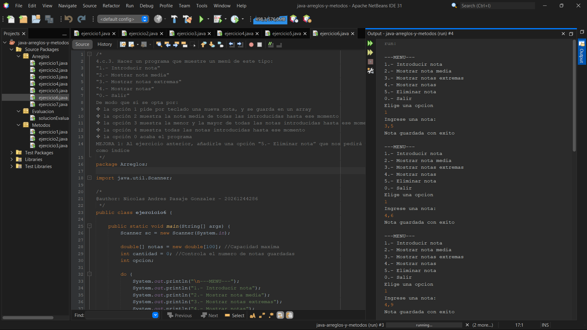
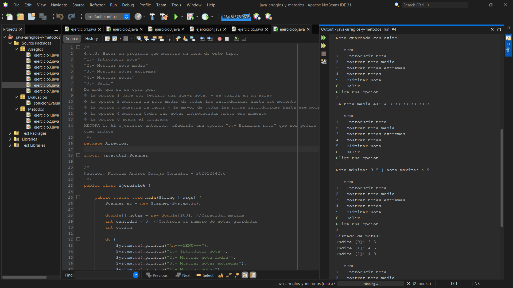
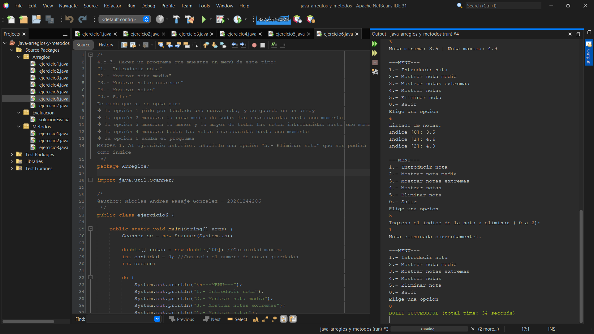

4.c.14.Realizar un programa que lea por teclado un array de 10 elementos numéricos enteros y una posición (entre 0 y 9). Eliminar el elemento situado en la posición dada sin dejar huecos.

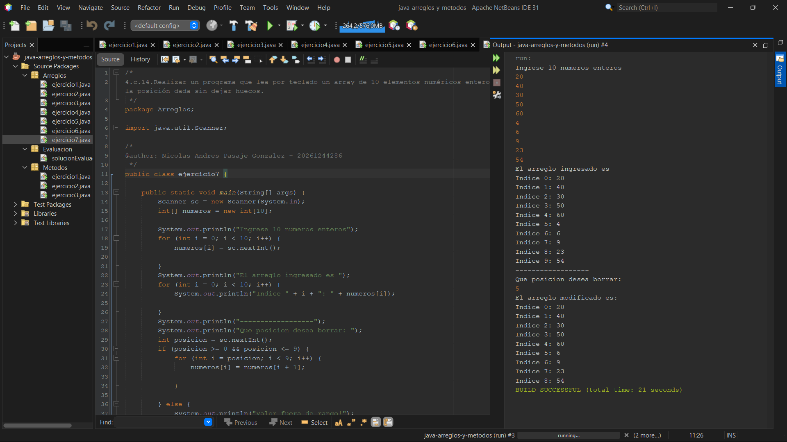

**Metodos**

5.b.10.Crear un método que recibe dos enteros (A y C) y calcula y devuelve A elevado a C
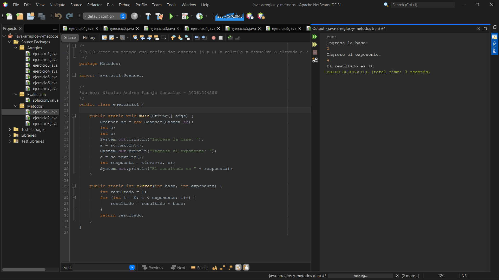

5.b.11.Crear un método que recibe como parámetros dos tablas (arrays). La primera con los 6 números de una apuesta de la primitiva, y la segunda con los 6 números ganadores. El método debe devolver el número de aciertos.
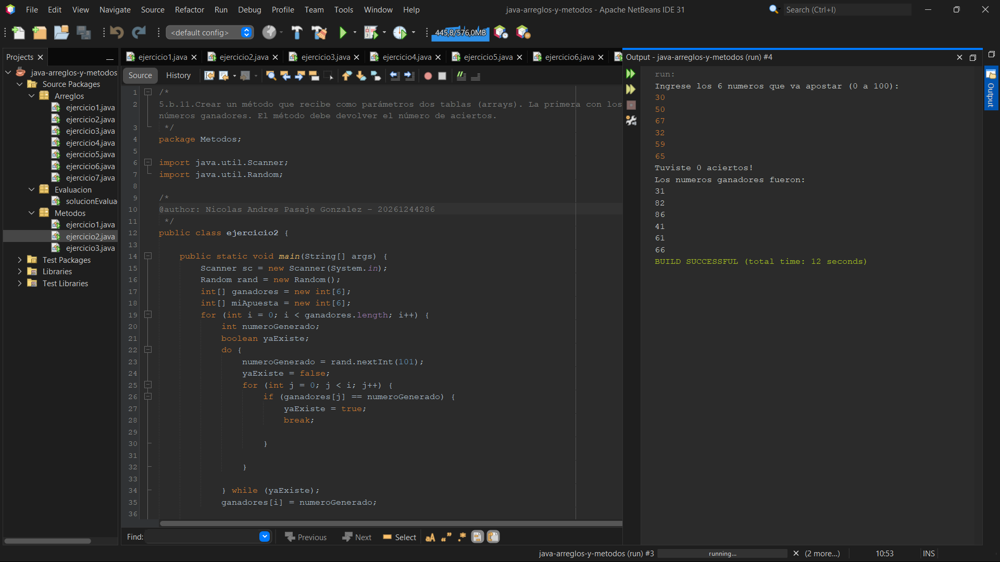

5.c.4. Crear un método que muestre en binario un número entre 0 y 255.
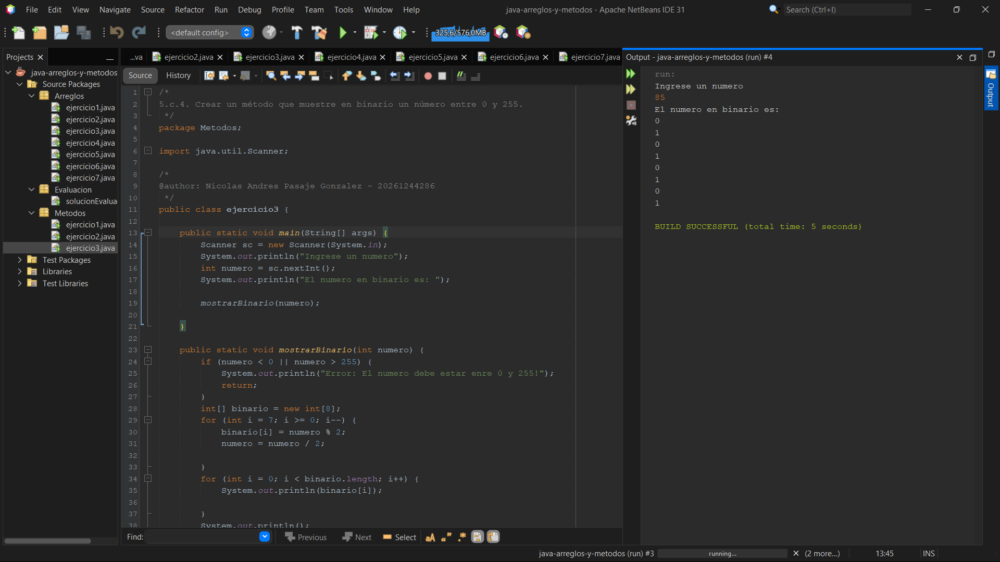

**Evaluacion**

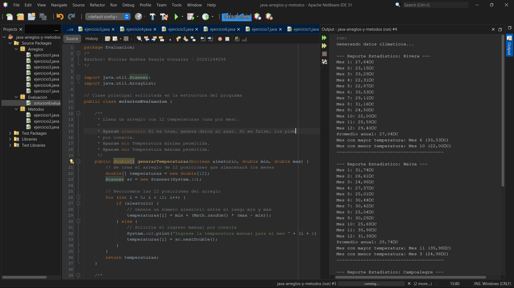
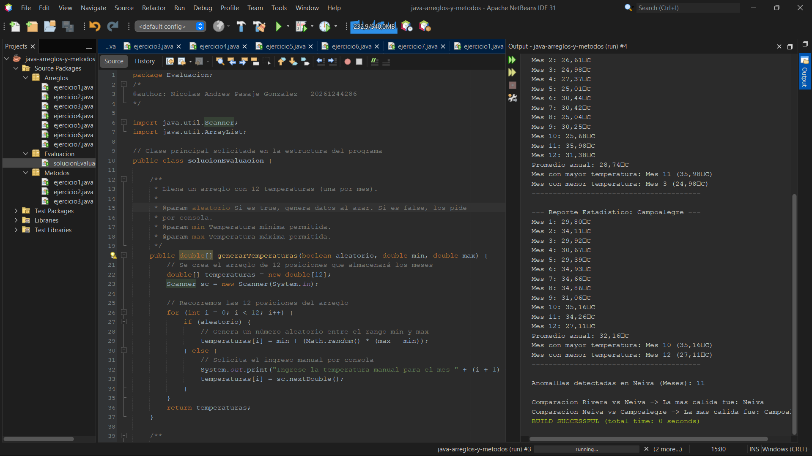